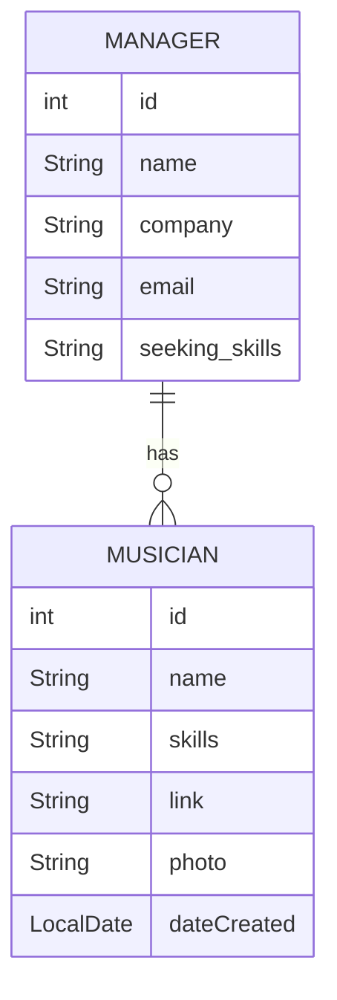

# Music Exchange - API Restful Project

## Objective
The project aims to connect musicians and managers, with the aim of helping the new musicians to get known.
The interaction takes place at the Admin level in the beginning, while working on a future version where both Musicians and Managers can create their own profiles and manage them as well.

## Tools & Tech
The project was build with SpringBoot Initializr version 3.3.6, JAR Packaging, 21 Java

### <ins>Back End</ins>
- [x]  

- [x] 

- [x] 

### <ins>Data & APIs</ins>

- [x] 

- [x] 

- [x] 


### <ins>Misc</ins>

- [x] 

- [x] 

- [x] 

- [x] 


## Dependencies
### Spring Boot Dependencies
- [x] spring-boot-starter-data-jpa
- [x] jackson-datatype-jsr310
- [x] spring-boot-starter-web
- [x] spring-boot-starter-validation

### Database Drivers
- [x] h2
- [x] postgresql
- [x] mysql-connector-j

### Testing Dependencies
- [x] spring-boot-starter-test
- [x] junit-jupiter-api
- [x] junit-jupiter-engine
- [x] mockito-core
- [x] mockito-junit-jupiter

### Lombok
- [x] lombok

### Springdoc OpenAPI
- [x] springdoc-openapi-starter-webmvc-ui

## Functionalities
- [x] Register Musicians, Search entire list, List by Name, Update and Delete
- [x] Register Managers, Search entire list, List by ID, Update and Delete
- [x] Connects to an API through JPA and H2
- [x] Each musician added to JPA receives an unique ID
- [x] CRUD tested with Postman
- [x] Using DTO Classes
- [x] Search by Status using Enum Class


## Tests
Pasos para ejecutar la aplicación y pasar los tests.

- [x] Musician Acceptance Test
- [] Tests Unitarios
- [] Global Exception Handling

## UML Diagram


## E/R Diagram

## Enum and Filters
Managers have an extra filter and can be sorted by the status Active/ Inactive.
While retrieving data using the GET by Status endpoint, it is necessary to write the status in capslock.
The endpoint for this application is: localhost:8080/api/get/managers/status/ACTIVE

## Profiles
Explicación de los perfiles.


## Kanban with GitHub Projects

## API Documentation
This project uses [Swagger](https://swagger.io/) for documenting the API endpoints. Swagger provides an interactive interface to explore and test the APIs.
### Accessing the Documentation

After running the application, you can access the Swagger UI by visiting:
http://localhost:8080/swagger-ui.html


### Example Endpoints

- **Get All Managers:** `GET /api/get/managers`
- **Create Manager:** `POST /api/post/managers`
- **Delete Manager:** `DELETE /api/del/managers/{id}`

### Swagger UI Preview

Below is a preview of the Swagger UI interface:


### Schemas IU Preview


### Swagger Setup

This project uses **Springdoc OpenAPI** for Swagger integration. The configuration is minimal and handled automatically. Dependencies used:

```xml
<dependency>
    <groupId>org.springdoc</groupId>
    <artifactId>springdoc-openapi-ui</artifactId>
    <version>1.6.15</version>
</dependency>
```

## About Me
**Andreea Celmare**

[](https://github.com/andreeaclmr) </br>
[](https://www.linkedin.com/in/andreea-alina-celmare/)


## Special Thanks
Sergi Virgili & Amr Hefny from Factoria F5


