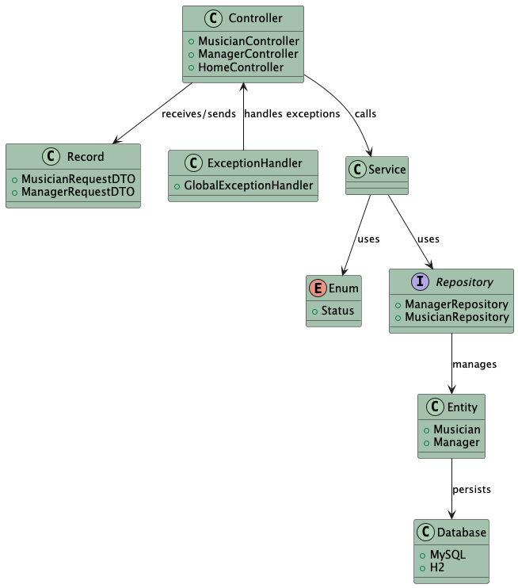
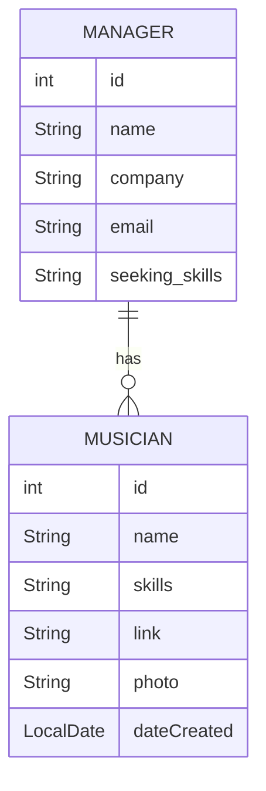
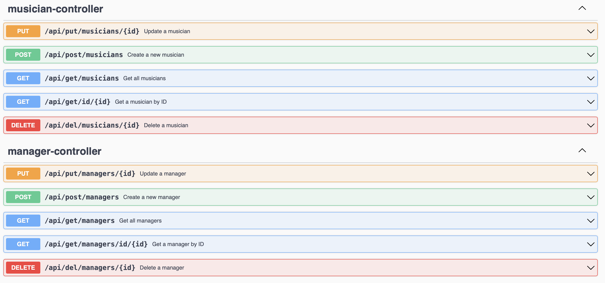
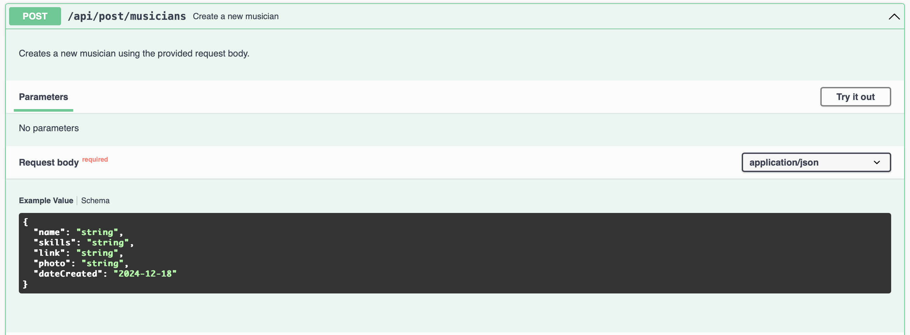
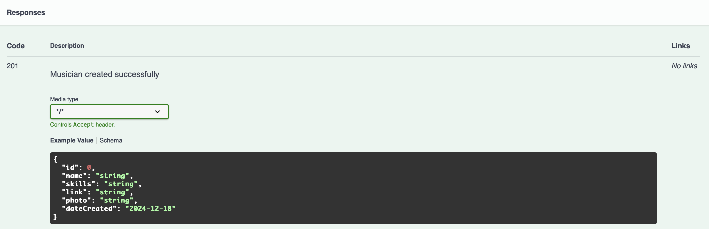
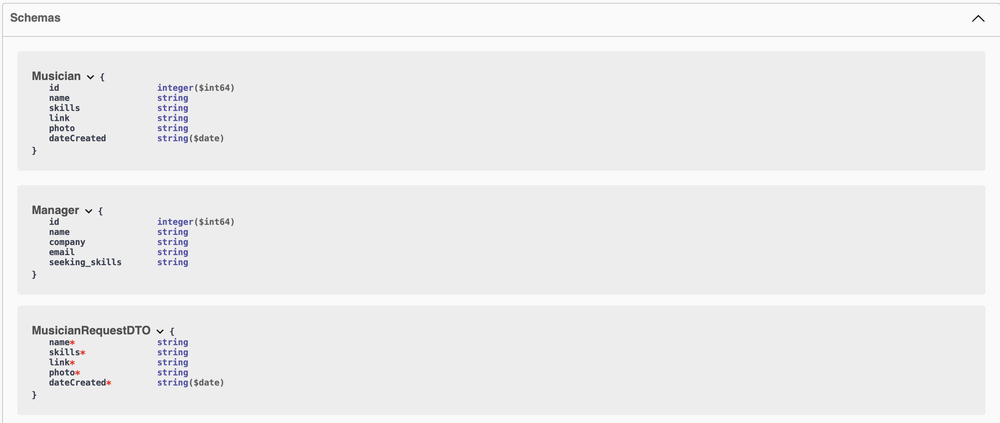
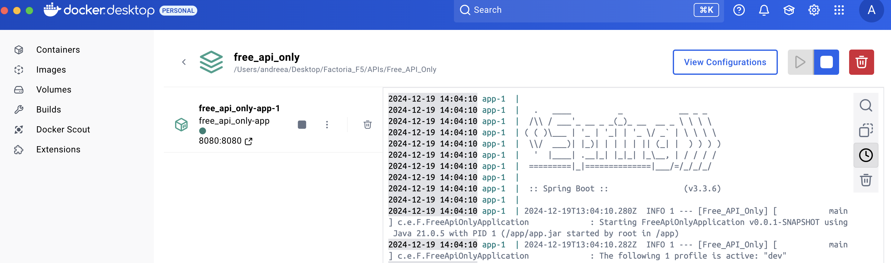
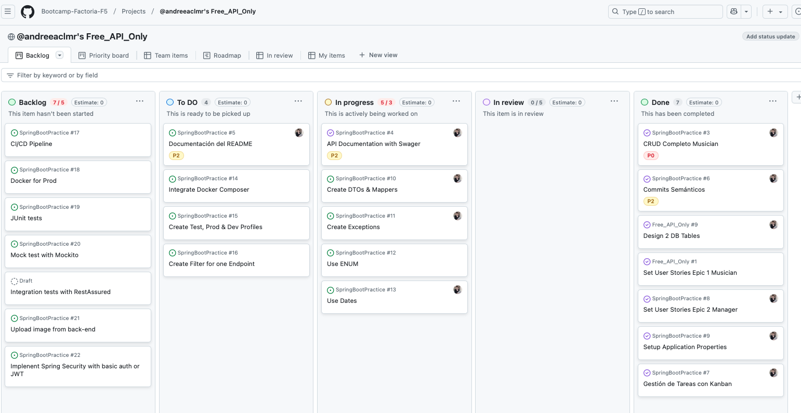

# Music Exchange - API Restful Project

## Objective
The project aims to connect musicians and managers, with the aim of helping the new musicians to get known.
The interaction takes place at the Admin level in the beginning, while working on a future version where both Musicians and Managers can create their own profiles and manage them as well.

## Getting Started - Installation
To run this project locally:
1. Clone the repository: `git clone <repository-url>`
2. Navigate to the project directory: `cd Free_API_Only`
3. Run the application with Maven: `mvn spring-boot:run`

## Technologies Used
The project was built with SpringBoot Initializr version 3.3.6, JAR Packaging, 21 Java

### Frameworks
- Spring
- Spring Boot Dependencies:
  - spring-boot-starter-data-jpa
  - spring-boot-starter-web
  - spring-boot-starter-validation
  - jackson-datatype-jsr310
- Springdoc OpenAPI (springdoc-openapi-starter-webmvc-ui)
- Lombok

### Database
- MySQL
- H2
- PostgreSQL
- Database Drivers:
  - mysql-connector-j
  - postgresql
  - h2

### Testing
- Spring Boot Testing Dependencies:
  - spring-boot-starter-test
  - junit-jupiter-api
  - junit-jupiter-engine
  - mockito-core
  - mockito-junit-jupiter

### Development Tools
- IntelliJ IDEA Community Edition
- Java
- Maven
- Postman
- GIT
- GitHub
- GitHub Projects


## Functionalities
- [x] Register Musicians, Search entire list, List by Name, Update and Delete
- [x] Register Managers, Search entire list, List by ID, Update and Delete
- [x] Connects to an API through JPA and H2
- [x] Each musician added to JPA receives an unique ID
- [x] CRUD tested with Postman
- [x] Using DTO Classes
- [x] Search by Status using Enum Class


### UML Diagram


### E/R Diagram


## Enum and Filters
- Managers have an extra filter and can be sorted by the status Active/ Inactive.
- While retrieving data using the GET by Status endpoint, it is necessary to write the status in capslock.
- The endpoint for this application is: localhost:8080/api/get/managers/status/ACTIVE

## Profiles
Added `application-dev.properties`, `application-test.properties`, and `application-prod.properties`
for environment-specific configurations.

Updated `application.properties` to set `dev` as the default active profile, to begin with.

Configured database settings and Hibernate behavior for each profile:
- `dev`: In-memory H2 database with schema updates.
- `test`: Separate H2 database for testing with `create-drop` behavior.
- `prod`: MySQL database with schema validation.

### Testing the active profiles:
Verified profile switching with `spring.profiles.active` and ensured correct configurations load.
- mvn spring-boot:run -Dspring-boot.run.profiles=dev
- mvn spring-boot:run -Dspring-boot.run.profiles=test
- mvn spring-boot:run -Dspring-boot.run.profiles=prod

## Tests
Steps to execute the aplication and pass the tests.

- [x] Musician Acceptance Test
- [in progress] Tests Unitarios
- [in progress] Global Exception Handling


## API Documentation
This project uses [Swagger](https://swagger.io/) for documenting the API endpoints. Swagger provides an interactive interface to explore and test the APIs.

```xml
<dependency>
    <groupId>org.springdoc</groupId>
    <artifactId>springdoc-openapi-ui</artifactId>
    <version>1.6.15</version>
</dependency>
```
### Accessing the Documentation

After running the application, you can access the Swagger UI by visiting:
http://localhost:8080/swagger-ui.html


### Example Endpoints

- **Get All Managers:** `GET /api/get/managers`
- **Create Manager:** `POST /api/post/managers`
- **Delete Manager:** `DELETE /api/del/managers/{id}`

### Swagger UI Preview

Below is a preview of the Swagger UI interface:





### Schemas IU Preview



## Docker Compose
- Using the DEV Profile
- Main endpoint defined in Home Controller GET("/")
- 2nd endpoint defined in MusicianController GET("/")

### Docker Commands
- docker-compose build
- docker-compose up
- docker-compose down
- docker ps - to find the container ID
- docker logs <container_id> - to check the logs




## Kanban with GitHub Projects


## GIT Branches
#### -  main
#### -  test
#### -  feat/docker
#### -  feat/manager
#### -  feat/musician
#### -  feat/profiles
#### -  feat/services


## About Me
### **Andreea Celmare**

[](https://github.com/andreeaclmr) </br>
[](https://www.linkedin.com/in/andreea-alina-celmare/)


## Special Thanks
Many thanks to my teachers, for their patience and wisdom:
- ### **Sergi Virgili** [](https://github.com/Sergi-Virgili)
- ### **Amr Hefny** [](https://github.com/amrhefny87)
- ### **Factoria F5** [](https://github.com/FactoriaF5Code)


